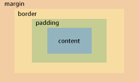

## 概要
> 首先盒子模型是由content、padding、border、margin组成，通过设置width、heigh来控制content的大小，但是盒子实际所占宽高是这四个的总和。

一般可以用box-sizing来改变盒子实际所占宽高包括的内容，比如
默认值content-box：设置的width，heigh就是content的宽高，总宽高就是content、padding、border、margin这四个的总和
border-box：就是设置的width就是content、padding和border的总和，所以总宽高就是margin和width
Inherit：就是从父元素继承box-sizing

## 附带知识
- 块级元素：以一个块的形式表现，和同级元素垂直排列，左右撑满
- 行内元素：元素横向排列，到最右端自动换行
- 水平margin：两个行内元素相邻，他们的距离是左右margin之和
- 垂直margin：两个块级元色相邻，他们的垂直距离是最大的那个margin
- 嵌套margin：子块的margin以父块的content为标准
- 负值margin：和正值相反方向

## flex布局-弹性布局：用来给盒子模型提供灵活性。主要由容器，项目组成（采用flex布局的叫做容器，子元素叫做项目），容器默认水平轴，交叉轴，默认水平轴
- 正常解决—position:absolute;top:50%;left:50%;transform:translate(-50%,-50%)
- flex解决—display:flex;justify:center;align-items:center
- 容器属性有6个
- Flex-direction:决定主轴方向是横轴还是纵轴
	- row-默认，水平轴起点左端
	- row-reverse-同样水平方向，起点右端
	- column-主轴为垂直方向，起点上端
	- column-reverse-同样垂直方向，起点下端
- Flex-wrap:决定如何换行 nowarp不换行，wrap：换行第一行上方，wrap-reverse，换行第一行下方
- Flex-flow:是flex-direction和flex-wrap简写
- Justify-content:项目再主轴的对其方式，
	- flex-start-左对齐
	- flex-end-右对齐
	- center-中间对齐
	- space-between-两端对齐，项目之间间隔相等
	- space-around-每个项目两侧间隔相等，左右边一半间隔
- Align-items:项目在交叉轴的对齐方向
	- flex-start-交叉轴起点
	- flex-end-交叉轴终点
	- center-交叉轴中点
	- baseline-项目第一行文字基线
	- stretch-默认值，未设置高度，占满容器高度
- Align-content:和align-items功能一样，只不过是针对于多行元素
- 项目属性：
- Order：定义排列顺序，数值越小越在前
- flex-grow：定义项目的放大比例，也就是占据空间，默认0
- Flex-shrink：默认1，缩小比例，0代表不缩小
- Flex-basis：和width相似，就是设置宽，默认auto，忽视width
- flex：是flex-grow、flex-shrink、flex-basis缩写
- Align-self：和align-items一样，不同之处在于可以单独设置某一个项目

