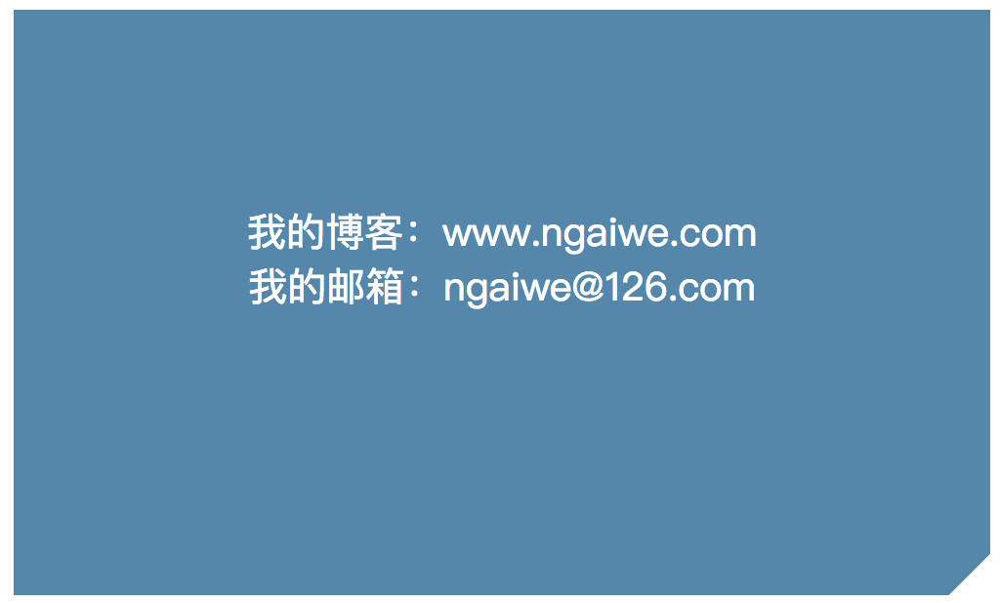
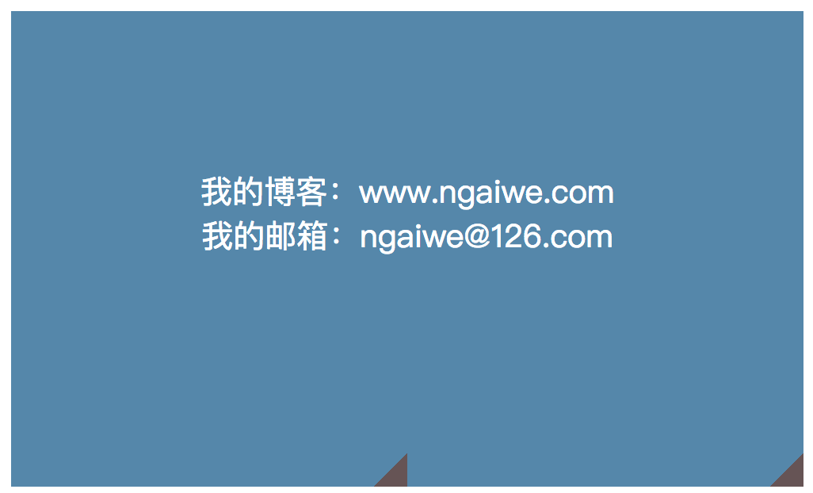
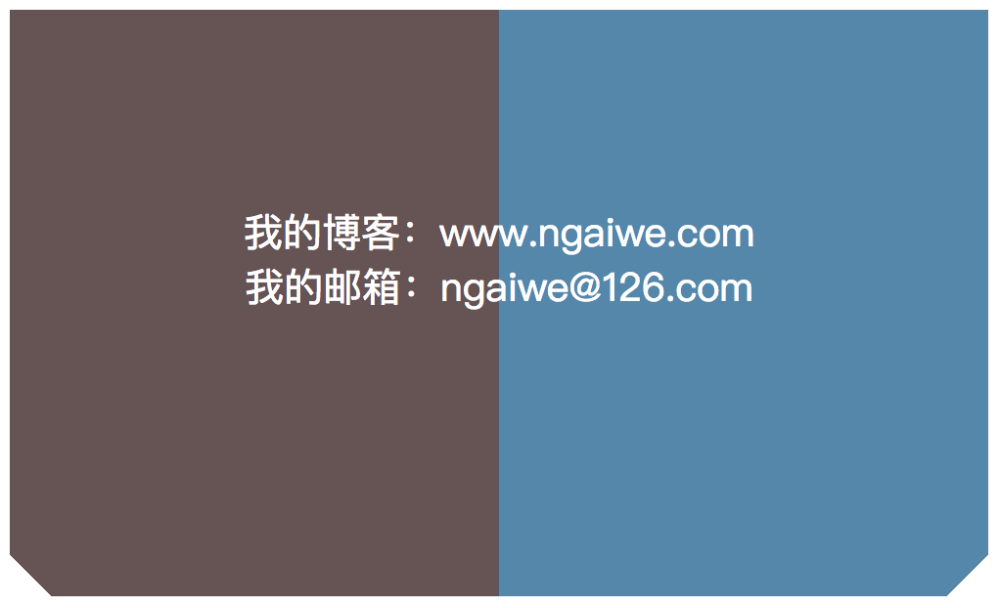
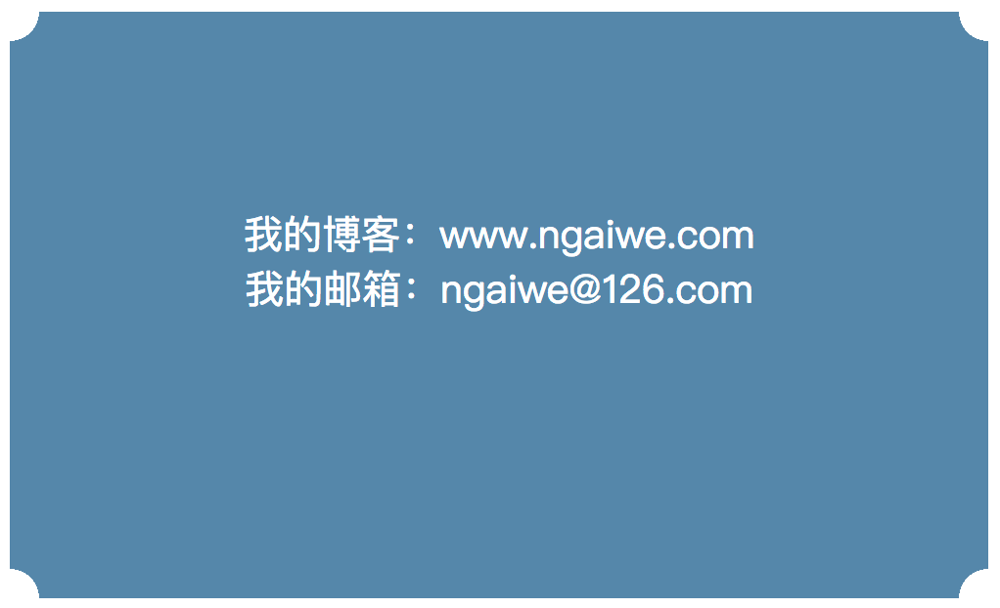

## CSS揭秘—摘要

> 写这篇文章主要原因是帮助爱看书爱学习而又嫌书中长篇大论太多从而不能坚持看完的码农们做的精华摘要，并且也帮助自己做一个知识存储。
>
> 此文章不包含《CSS揭秘》全部内容，只做摘要，提取出工作常用场景，如果想了解更多全面内容推荐阅读此书。

## 简介

> 这本书主要针对中高级进阶的CSS开发者，认识更多特性和掌握更多好的方法，当然书中内容不乏简单对于中高级CSS开发者，但是我认为一本书只要能学到不会的东西也算值了，不能要求他所讲述的面面俱到，私下里还需我们进一步探索。

## 第二章 背景与边框

> 第一张引言就不在此诉说了，没什么用，直接干货。

1. **RGBA/HSLA**

   - RGBA:红、绿、蓝、透明度
   - HSLA:色调、饱和度、亮度、透明度

   概念模糊可以查看[《CSS颜色手册》](http://www.css88.com/book/css/values/color/index.htm)

2. **半透明边框**

   > 主要用到background-clip来改变背景绘画区域

   Background-clip:border-box

   - border-box(默认):背景被裁剪到盒子模型范围content+padding+border
   - padding-box:背景被剪裁到盒子模型范围content+padding
   - Content-box:背景被剪裁到盒子模型范围content

   盒子模型如果概念模糊，可以查看我写的另外一篇文章关于盒子模型的[《盒子模型原理》](http://ngaiwe.com/2018/02/11/css/boxModel/)

   具体核心代码如下：

   ```bash
   border:10px solid hsla(0,0%,100%,.5);
   background:white;
   background-clip:padding-box;
   ```

3. **多重边框**

   > 主要用到box-shadow阴影的第四个属性扩张半径

   Box-shadow:none

   - none(默认):无阴影
   - Length1:第1个长度值用来设置对象的阴影水平偏移值。可以为负值
   - Length2:第2个长度值用来设置对象的阴影垂直偏移值。可以为负值
   - Length3:如果提供了第3个长度值则用来设置对象的阴影模糊值。不允许负值
   - length4:如果提供了第4个长度值则用来设置对象的阴影外延值。可以为负值
   - Color:设置对象的阴影的颜色。

   具体核心代码如下：(<font color=red>注意:box-shadow扩张半径是层层叠加，重合部分上一层覆盖下一层。</font>)

   ```bash
   background: yellowgreen;
   box-shadow: 0 0 0 10px #655,
               0 0 0 15px deeppink,
               0 0 0 20px pink;
   ```

4. **灵活的背景定位**

   > 主要解决css2.1中定位左下角并且距离边框有偏移问题

   Background-position:概念模糊查看[《Background-position》](http://www.css88.com/book/css/properties/background/background-position.htm)

   具体代码如下：

   ```bash
   background:url("./IMG_3789.JPG") no-repeat #58a;
   background-position: right 20px bottom 20px;
   ```

   calc()函数可以完美在Background-position中完成上面效果(注意：加减号左右有空格)

   ```bash
   background:url("./IMG_3789.JPG") no-repeat #58a;
   background-position: calc(100% - 20px) calc(100% - 20px);
   ```

   Background-origin:设置Background-position的参考原点，可以让背景图位置从padding、border、content区域显示[《Background-origin》](http://www.css88.com/book/css/properties/background/background-origin.htm)

5. **连续的图像边框**

   > 主要原理是给两个不同背景指定不同的background-clip

   代码如下：

   ```bash
   padding: 10px;
   border: 15px solid transparent;
   background: 
   	linear-gradient(white,white),
   	url('./IMG_3789.JPG');
   background-size: cover;
   background-clip: 
   	padding-box,//为linear-gradient(white,white)指定剪裁区域
   	border-box;//为url('./IMG_3789.JPG')指定剪裁区域
   background-origin: border-box;//设置背景坐标起始原点
   ```

   > 信封效果，起始就是背景用的渐变来代替图片，原理都一样

   ```bash
   background: 
   	linear-gradient(white,white),
   	repeating-linear-gradient(-45deg,
   		red 0,red 12.5%,transparent 0,transparent 25%,
   		#58a 0, #58a 37.5%,transparent 0, transparent 50%);
   ```

## 第三章 形状

1. **平行四边形**

    > 主要用到skew()变形，但是如果只做shew()其中文字也会同样倾斜，需要伪类

    shew():概念模糊查看[《transform》](http://www.css88.com/book/css/properties/transform/transform.htm)

    代码如下：

    ```bash
    .box{
        position: relative;
        margin: 100px;
        width: 200px;
        height: 100px;
        z-index: 1;
        text-align: center;
        line-height: 100px;
    }
    .box::before{
        content: '';
        width: 200px;
        height: 100px;
        position: absolute;
        top: 0;
        left: 0;
        z-index: -1;
        background: #58a;
        transform: skewX(-45deg);
    }
    ```

2. **菱形图片**

    > 主要是将上面所讲菱形做旋转rotate()，但是仅仅做完旋转会得到一个八边形，因为max-width的宽度100%被解析为.picture盒子的边长，但是我们需要的是让图片最大宽度为对角线的宽度，因为对角线宽度为等腰三角形边长，然后根据勾股定理是正方形边长的√2≈1.414，所以用scale放大1.42倍

    代码如下：

    ```bash
    //HTML
    <div class="picture">
        
    </div>
    
    //CSS
    .picture{
        margin: 100px;
        width: 400px;
        transform: rotate(45deg);
        overflow: hidden;
    }
    .picture > img{
        max-width: 100%;
        transform: rotate(-45deg);
    }
    ```

    > 可以用clip-path方法代替上述方法，但是浏览器兼容存在很大问题，如想了解请查阅[《clip-path官方说明》](https://developer.mozilla.org/zh-CN/docs/Web/CSS/clip-path)

3. **切角效果**

    > 要完成如下图所示效果，主要采用万能渐变

    

    Line-gradient:概念模糊查看[《Line-gradient》](http://www.css88.com/book/css/values/image/linear-gradient().htm)

    代码如下:

    ```bash
    .box{
        width: 500px;
        height: 300px;
        background: #58a;
        background: linear-gradient(-45deg,transparent 15px, #58a 0)
    }
    ```

    > 上面用法只针对于一个角，如果需要多个角，首先我们想到的是用两个渐变，如下所示

    ```bash
    background: 
        linear-gradient(-45deg,transparent 15px, #58a 0),
        linear-gradient(45deg,transparent 15px, #655 0);
    ```

    > 但是此方法行不通，因为默认情况下，这两层渐变都会填满整个元素，会相互覆盖。所以我们需要让他们各自缩小，站整个元素一半面积，如下

    ```bash
    background: 
        linear-gradient(-45deg,transparent 15px, #58a 0) right,
        linear-gradient(45deg,transparent 15px, #655 0) left;
    background-size: 50% 100%;
    ```

    

    > 如上图所示，出现了渐变图案平铺了两次，所以我们需要关闭background-repeat

    ```bash
    background: 
        linear-gradient(-45deg,transparent 15px, #58a 0) right,
        linear-gradient(45deg,transparent 15px, #655 0) left;
    background-size: 50% 100%;
    background-repeat: no-repeat;
    ```

    

    > 根据上图，不难知道如何实现，四个切角，具体代码如下

    ```bash
    background: #58a;
    background: 
        linear-gradient(135deg,transparent 15px, #58a 0) top left,
        linear-gradient(-135deg,transparent 15px, #58a 0) top right,
        linear-gradient(45deg,transparent 15px, #58a 0) bottom left,
        linear-gradient(-45deg,transparent 15px, #58a 0) bottom right;
    background-size: 50% 50%;
    background-repeat: no-repeat;
    ```

    > 拓展：弧形切角，主要差别是用径向渐变radial-gradient

    radial-gradient:概念模糊查看[《radial-gradient》](http://www.css88.com/book/css/values/image/radial-gradient().htm)

    代码如下：

    ```bash
    background: #58a;
    background: 
        radial-gradient(circle at top left,transparent 15px, #58a 0) top left,
        radial-gradient(circle at top right,transparent 15px, #58a 0) top right,
        radial-gradient(circle at bottom right,transparent 15px, #58a 0) bottom right,
        radial-gradient(circle at bottom left,transparent 15px, #58a 0) bottom left;
    background-size: 50% 50%;
    background-repeat: no-repeat;
    ```

    

4. **梯形标签页**
    <font color=red>未完待续</font>

## 博客

[魏燃技术博客](http://www.ngaiwe.com)

有任何问题可留言或者发送本人邮箱ngaiwe@126.com


