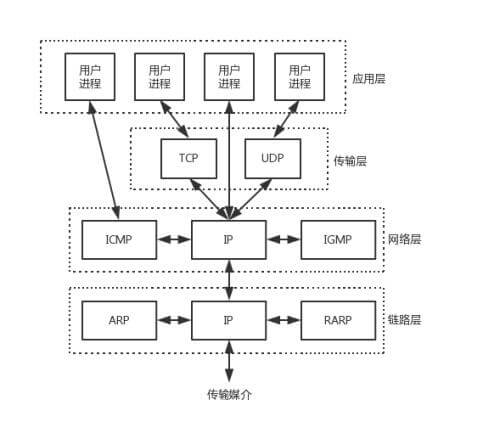
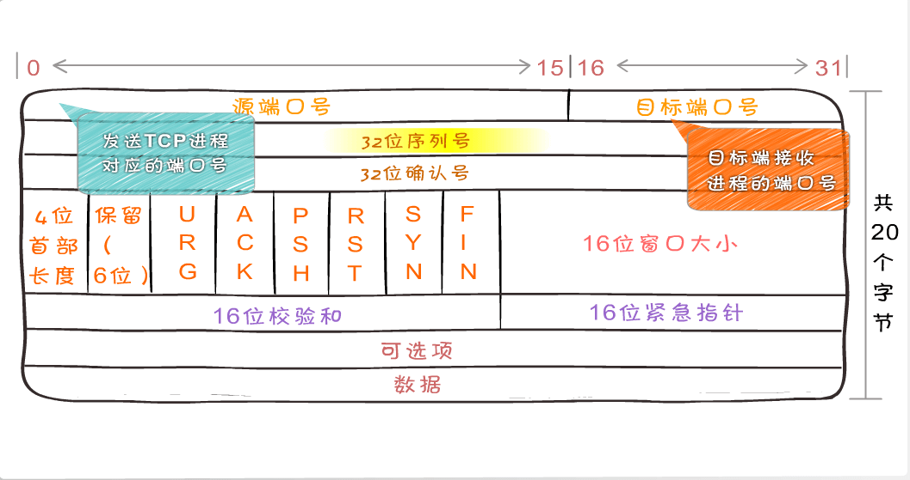
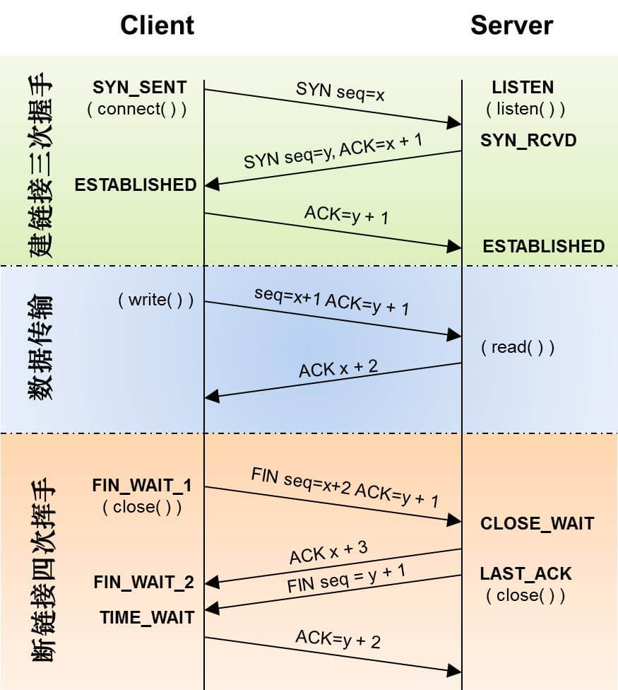
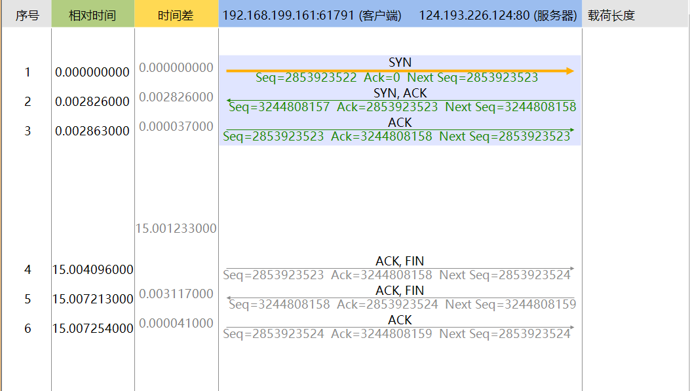
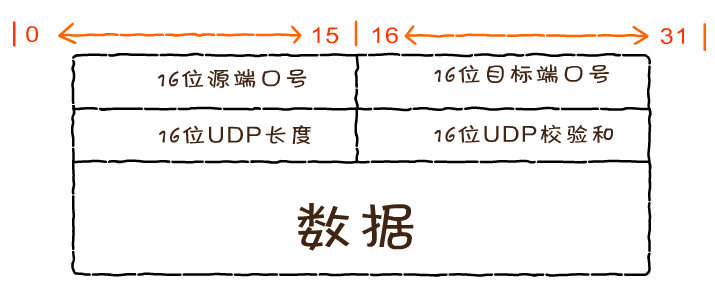
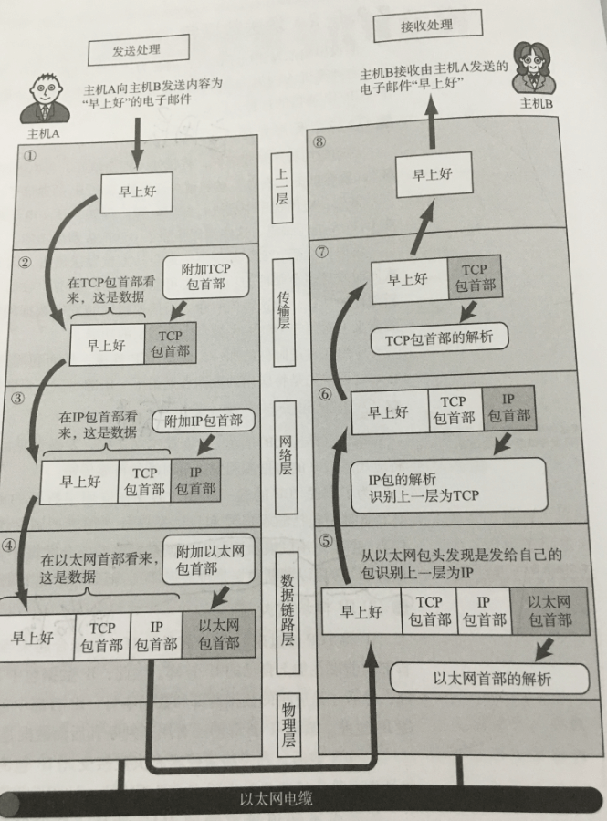

## 一.OSI七层网络模型—Open System Interconnection

|           OSI           |                    功能                    |               TCP/IP协议               |
| :---------------------: | :--------------------------------------: | :----------------------------------: |
| 应用层(Application Layer)  | 面向计算机用户，提供应用程序和网络之间的接口，向用户提供服务，完成用户希望在网上完成的各种工作 | HTTP，HTTPS，FTP，TELNET，SSH，SMTP，POP3等 |
| 表示层(Presentation Layer) | 处理来自应用层的的命令和数据，对各种语法解释，按照规格传给会话层。处理编码，数据可是转换和加密解密 |                 没有协议                 |
|   会话层(Session Layer)    | 用户应用程序和网络之间的接口，向两个实体表示层提供连接和连接方法，不同实体之间的表示层连接叫做会话，因此主要功能是维护和协调会话之间的数据通信 |                 没有协议                 |
|  传输层(Transport Layer)   | 为会话层和网络层提供传输服务，从会话层获得数据，在必要时进行分割，然后传送给网络层，主要起到建立，维护和取消传输连接功能，负责两节点的可靠传输 |               TCP、UDP                |
|   网络层(Network Layer)    | 通过路由算法(两节点之间可能有多条路径)，为报文选择最适当的路径，在网络层数据转换为数据包，通过路径选择等控制，将信息从一个网络设备传送到另一个网络设备 |      IP、ICMP、RIP、OSPF、BGP、IGMP等      |
| 数据链路层(Data Link Layer)  | 数据链路层的数据传输单元成为帧，就是将网络层转发的数据封装为帧，传输给物理层，以及分析物理层传输过来的数据帧 |     SLIP、CSLIP、PPP、ARP、RARP、MTU等     |
|   物理层(Physical Layer)   | 为数据链路层提供数据帧和接收数据帧然后管理电脑通信设备和网络媒体之间的互通。包括了针脚、电压、线缆规范、集线器、中继器、网卡、主机适配器等 |               ISO2110等               |

## 二 .TCP/IP模型

|     OSI     | TCP/IP |             协议              |
| :---------: | :----: | :-------------------------: |
| 应用层/表示层/会话层 |  应用层   | HTTP、FTP、TFTP、SMIP、SNMP、DNS |
|     传输层     |  传输层   |           TCP、UDP           |
|     网络层     |  网络层   |    ICMP、IGMP、IP、ARP、RARP    |
|  数据链路层/物理层  | 网络接口层  |          由底层网络定义协议          |

## 三.TCP/IP分层模型图

- 链路层—网络接口层

  网络接口层是TCP/IP模型的最底层，负责接收从上一层交来的数据报并将数据报通过底层的物理网络发送出去，比较常见的就是设备的驱动程序。ARP（地址解析协议）和RARP（逆地址解析协议）是某些网络接口（如以太网和令牌环网）使用的特殊协议，用来转换IP层和网络接口层使用的地址

- 网络层

  对应OSI网络层，负责数据包装、寻址、路由和交换错误报文。只管传送数据，不管成功与否

  IP网络协议一种不可靠的服务，快速将源节点送到目标节点，被TCP/UDP使用，TCP和UDP的每组数据都通过端系统和每个中间路由器中的IP层在互联网中进行传输。

- 传输层

  位于应用层和网络接口层之间，为两台主机提供端到端的通信，在TCP/IP协议族中，有两个互不相同的传输协议：TCP（传输控制协议）和UDP（用户数据报协议）。

  TCP为两台主机提供高可靠性的数据通信，如图：

  

  TCP首部最小为20字节，这20字节分为5行，每行4个字节也就是32个位。

  - 第一行是源端口号和目标端口号，分别占用16位，也就是端口号最大是2^16，所以端口号的范围是0~65536

  - 第二行，第三行分别是32位序列号和32位确认号，在建立连接时，计算机生成一个随机序列号作为初始值，传递给目标，当对方接收完毕之后，接收端会返回一个32位确认应答号是序列号加数据长度，当发送端收到确认应答号后，用来确认这个位置以前所有数据都被正常接收，否则将会从新连接发送

  - 第四行主要分为两大部分，左侧16位分别是4位首首部长度，如果没有可选字段，那这里的值就是5，表示TCP首都的长度为20字节，也就是说5行x每行32bit。一位8bit，所以就是5x4=20字节。然后是6位保留用作未来使用，暂时都为0.

    然后是6位控制位，连接，传输和断开都受到这六个控制位的指挥

    - URG (urgent紧急)  — 紧急标志位，表示的是此报文段中有紧急数据，将紧急数据排在普通数据的前面；当接受端收到此报文后后必须先处理紧急数据，而后再处理普通数据。 通常用来暂时中断通信
    - ACK (acknowledgement确认) — 置1时表示确认号合法，为0表示数据段不包含确认信息，确认号被忽略
    - PSH (push推送) — 置1时请求的报文在接收方收到时，会尽快交付接收应用进程，而不在等到整个缓存区都填满后再交付给应用进程
    - RST (reset重置) — 置1时重新连接，表示出现错误，需要释放连接，再重新建立连接
    - SYN (synchronous同步) — 置1时连接请求或同意报文，当SYN=1而ACK=0时，表明这是一个连接请求报文段。对方若同意建立连接，则应在响应的报文段中使SYN=1和ACK=1
    - FIN (FINis终止) — 释放连接，提出断开连接的一方将FIN置为1表示断开连接 

    然后第二部分是16位窗口大小

    - 窗口 — 指对于发送报文段一方而言的接收窗口。
      窗口值 — 则是告诉发送方，从报文段首部的确认号算起，接收方目前允许对方发送的数据量

  - 第五行分别为16位校验和、16位紧急指针

    - 16位校验和 — 发送端计算校验和，接收端进行检验计算和，如果两次校验一致表示数据正确，否则认为数据被破坏，接收端将丢弃该数据，主要用来差错控制
    - 16位紧急指针 — 当URG置为1时，指向后面优先数据，URG为0时，则无效作为填充，主要用来加快处理标识为URG的紧急数据

  - 可选项 — TCP头部长度最多为60字节，所以可选项最多为40字节，在这里不做太多陈述，具体可查阅[TCP头部选项](http://book.51cto.com/art/201306/400263.htm)

- 应用层

  应用层是我们经常接触使用的部分，比如常用的http协议、ftp协议(文件传输协议)、snmp(网络管理协议)、telnet(远程登录协议)、smtp(简单邮件传输协议)、dns(域名解析)，主要是面向用户的交互的。这里的应用层集成了osi分层模型中 的应用、表示、会话层三层的功能。

### TCP三次握手，四次挥手

- TCP是面向连接的协议，它在源点和终点之间建立虚拟连接，而不是物理连接
- 在数据通信之前，发送端与接收端要先建立连接，等数据发送结束后，双方再断开连接
- TCP连接的每一方都是由一个IP地址和一个端口组成

- 首先建立连接，客户端连接服务端，发送32位序列号seq=x，并且SYN置1，服务端监听客户端发送的序列号，然后发送32位确认响应swq=y和ack=x+1，并将SYN、ACK置1，然后客户端接收以后，说明服务端接收成功，然后再返回ack=y+1，表示客户端已经接收成功可以开始连接
- 当需要断开数据的时候，客户端发送序列号seq=x+2，确认号ack=y+1，并FIN置1，服务端接收以后，返回ack=x+3，并ACK置1，如果有数据没有传送完毕，等待传送完毕返回序列号seq=y+1也就是返回确认号，并FIN置1，如果没有数据则合并ack=x+3，seq=y+1 FIN置1，最后客户端接收以后返回给服务端确认号ack=y+2来确认断开

### 抓包

- Window用科来网络分析系统，如图

  

  - 如图所示三次握手，第一次客户端发送seq序列号，ACK置0，SYN置1。然后服务端收到序列号后发送列号seq，确认号ack为客户端序列号+1，且SYN、ACK置1，然后客户端接收以后发送序列号为服务端的ack确认号，并发送确认号为服务端序列号+1，且ACK置1
  - 如图所示四次挥手变三次挥手，因为没有数据需要等待传输，首先客户端发送序列号为服务端在握手中发送的确认号，确认号为服务端发送的序列号+1，且ACK、FIN置1，当服务端收到以后开始发送给客户端，序列号为客户端发送的确认号，确认号为客户端发送的序列号+1，且ACK、FIN置1，当客户端收到以后再发送给服务端，序列号为服务端发的确认号，确认号为服务端发送的序列号+1，且ACK置1，结束连接

- Mac用WireShark

  WireShark主要用于抓包，在这里我们需要用wireshark查看tcp的三次握手和4次挥手，具体请查看[WireShark教程](https://www.cnblogs.com/TankXiao/archive/2012/10/10/2711777.html)

## UDP则为应用层提供一种非常简单的服务，如图：

- UDP是一个无连接、不保证可靠性的传输层协议，也就是说发送端不关心发送的数据是否到达目标主机、数据是否出错等，收到数据的主机也不会告诉 发送方是否收到了数据，它的可靠性由上层协议来保障
- 首部结构简单，在数据传输时能实现最小的开销，如果进程想发送很短的报文而对可靠性要求不高可以使用

- 16位源端口号和16位目标端口号和TCP一样
- 16位UDP长度代表数据长度
- 16位UDP校验和，用于差错控制
- 主要应用于QQ、视频软件、TFTP 简单文件传输协议(短信)

## 三.应用交互举例

### 四.参考

- [TCP/IP分层模型](http://blog.csdn.net/be_happy_mr_li/article/details/52243006)
- [TCP/IP维基](https://zh.wikipedia.org/wiki/OSI%E6%A8%A1%E5%9E%8B)
- [OSI七层模型详解](http://blog.csdn.net/yaopeng_2005/article/details/7064869)

### 五.博客

[魏燃技术博客](http://www.ngaiwe.com)

有任何问题可留言或者发送本人邮箱ngaiwe@126.com

