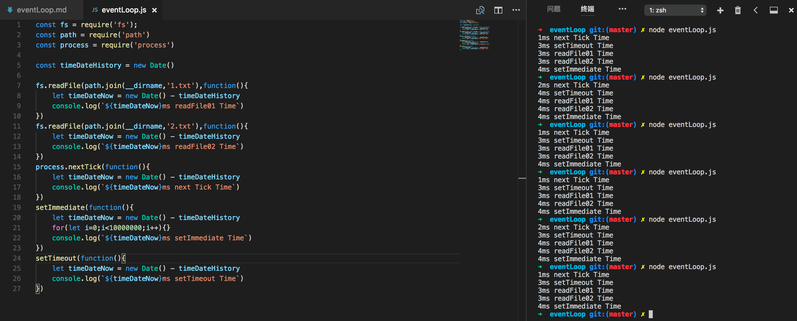
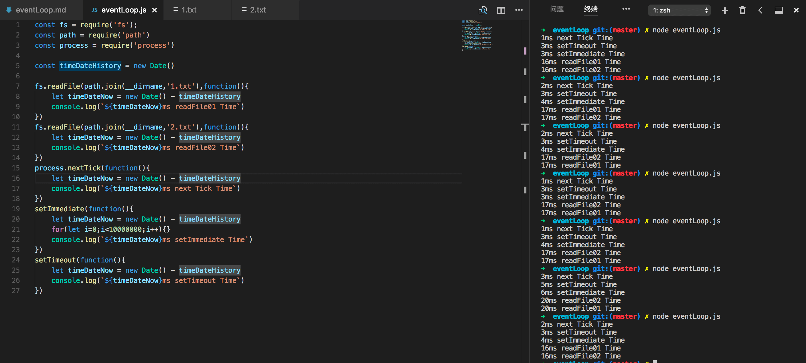
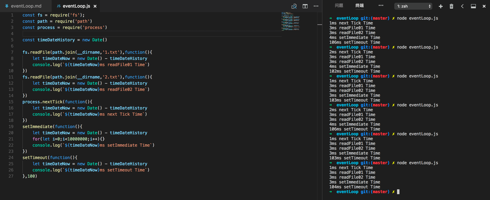
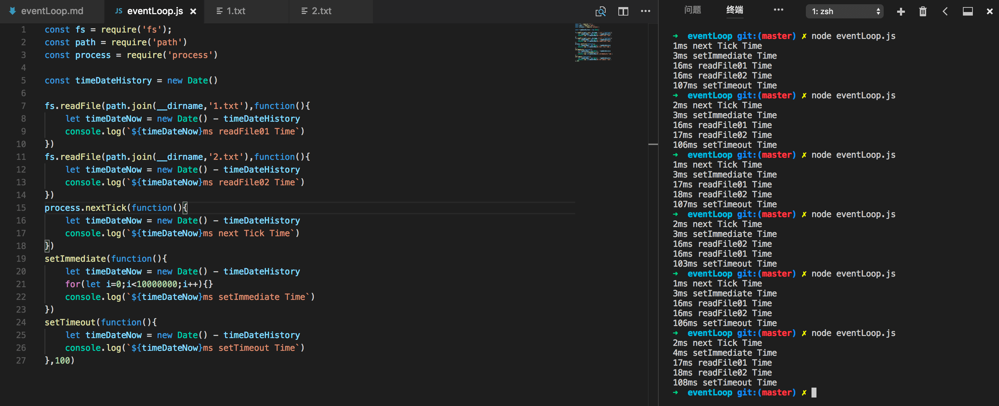

#### javascript的运行机制，Event Loop

## 单线程
### javascript为什么是单线程语言，原因在于如果是多线程，当一个线程对DOM节点做添加内容操作的时候，另一个线程要删除这个DOM节点，这个时候，浏览器应该怎么选择，这就造成了混乱，为了解决这类问题，在一开始的时候，javascript就采用单线程模式。
## 在后面H5出的web worker标准的时候，看似是多线程，其实是在一个主线程来控制其他线程，而且不能操作DOM，所以本质还是单线程

## 任务队列
### 任务可以分为两种，一种为同步，另一种为异步（具有回调函数）。如下图：

### 所有的同步任务都在主线程上执行，形成一个执行栈 stack。当所有同步任务执行完毕后，它会去执行microtask queue中的异步任务（nextTick，Promise），将他们全部执行。主线程之外还有一个任务队列task queue，当有异步任务（DOM，AJAX，setTimeout，setImmediate）有结果的时候，就在任务队列里放一个事件，一旦执行栈和microtask queue任务执行完毕，系统就会读取任务队列，将取出排在最前面的事件加入执行栈执行，这种机制就是任务队列。

## Event Loop
### 主线程在任务队列中读取事件，这个过程是循环不断地，所以这种运行机制叫做Event Loop（事件循环）

## nextTick、setImmediate、setTimeout
### nextTick是在执行栈同步代码结束之后，下一次Event Loop（任务队列）执行之前。当所有同步任务执行完，会在queue中执行nextTick，无论nextTick有多少层回调，都会执行完毕后再去任务队列，所以会造成一直停留在当前执行栈，无法执行任务队列，请看下面代码
``` bash
process.nextTick(function () {
    console.log('nextTick1');
    process.nextTick(function (){console.log('nextTick2')});
});
  
setTimeout(function timeout() {
    console.log('setTimeout');
}, 0)
```
### 执行完毕后输出nextTick1、nextTick2、setTimeout，原因是nextTick是在当前执行栈末尾执行，而setTimeout是在下次任务队列在执行

### setImmediate方法是在Event Loop（任务队列）末尾，也就是下一次Event Loop时执行。
### setTimeout方法是按照执行时间，放入任务队列，有时快与setImmediate有时慢。请看以下代码
``` bash
setImmediate(function () {
    console.log('setImmediate1');
    setImmediate(function (){console.log('setImmediate2')});
});
  
setTimeout(function timeout() {
    console.log('setTimeout');
}, 0);
```
### 这段代码执行完可能是setImmediate1、setTimeout、setImmediate2，也可能是setTimeout、setImmediate1、setImmediate2，原因是setTimeout和setImmediate1都是在下次Event Loop中触发，所以先后不确定，但是setImmediate2肯定是最后，因为他是在setImmediate1任务队列之后，也就是下下次Event Loop执行

## Node.js的Event Loop
### Node.js也是单线程的Event Loop但是和浏览器有些区别，如图所示，
### 1.先通过Chrom V8引擎解析Javascript脚本
### 2.解析完毕后调用Node API
### 3.LIBUV库负责Node API的执行，将不同任务分配给不同的线程，形成一个Event Loop（任务队列）
### 4.最后Chrom V8引擎将结果返回给用户


## Node.js Event Loop原理
### node.js的特点是事件驱动，非阻塞单线程。当应用程序需要I/O操作的时候，线程并不会阻塞，而是把I/O操作交给底层库（LIBUV）。此时node线程会去处理其他任务，当底层库处理完I/O操作后，会将主动权交还给Node线程，所以Event Loop的用处是调度线程，例如：当底层库处理I/O操作后调度Node线程处理后续工作，所以虽然node是单线程，但是底层库处理操作依然是多线程

## Node Event Loop的事件处理机制
``` bash
   ┌───────────────────────┐

┌─>│        timers         │

│  └──────────┬────────────┘

│  ┌──────────┴────────────┐

│  │     I/O callbacks     │

│  └──────────┬────────────┘

│  ┌──────────┴────────────┐

│  │     idle, prepare     │

│  └──────────┬────────────┘      ┌───────────────┐

│  ┌──────────┴────────────┐      │   incoming:   │

│  │         poll          │<─────┤  connections, │

│  └──────────┬────────────┘      │   data, etc.  │

│  ┌──────────┴────────────┐      └───────────────┘

│  │        check          │

│  └──────────┬────────────┘

│  ┌──────────┴────────────┐

└──┤    close callbacks    │

   └───────────────────────┘
```
### 上面处理阶段都是按照先进先出的规则执行回调函数，按顺序执行，直到队列为空或是该阶段执行的回调函数达到该阶段所允许一次执行回调函数的最大限制后，才会将操作权移交给下一阶段。
- timers: 用来检查setTimeout()和setInterval()定时器是否到期，如果到期则执行它，否则下一阶段
- I/O callbacks: 用来处理timers阶段、setImmediate、和TCP他们的异常回调函数或者error
- idle, prepare: nodejs内部函数调用，在循环被I/O阻塞之前prepare回调就会立即调用
- poll: 用来监听fd的事件的，比如socket的可读，可写，文件的可读可等等
- check: setImmediate()函数只会在这个阶段执行
- close callbacks: 执行一些诸如关闭事件的回调函数，如socket.on('close', ...)

## 具体分析，看下图：
### 1.当setTimeout时间最小，读取文件不存在的时候

### 如图所示，分别是nextTick、readFile、setTimeout、setImmediate，然而现在并没有1.txt和2.txt文件，输出结果是next Tick、setTimeout、readFile、setImmediate，在event loop中先判断的是timeers，最先出书next Tick因为process.nextTick的实现是基于v8 MicroTask(是在当前js call stack 中没有可执行代码才会执行的队列,低于js call stack 代码，但高于事件循环，不属于Event Loop，上面javascript的Event Loop介绍过了，所以最先输出。然后开始走Event Loop，第一阶段是timers，判断setTimeout到期，所以输出setTimeout，进入下一阶段，poll将I/O操作权交出，新线程操作，但是并没有相关读取文件，所以直接返回回调函数，所以处处readFile，最后到check阶段，输出setImmediate

### 2.当setTimeout时间最小，读取文件存在的时候

### 如图所示，分别是nextTick、setTimeout、setImmediate、readFile，这次readFile在最后面，是因为文件存在，执行到poll阶段的时候，执行I/O操作，node线程开始执行check阶段，当交出的I/O操作结束后，返回给Event Loop所以再执行readFile的回调函数，所以他在最后面

### 3.当setTimeout时间为100毫秒，读取文件不存在的时候

### 如图所示，分别是nextTick、readFile、setImmediate、setTimeout，它和1不同的地方是setTimeout排在最后了，这是因为在执行timers的时候，setTimeout没有到期，所以直接执行下一阶段，当执行完poll的时候，会去执行查看定时器有没有到期，如果没有下一次Event Loop再次查看，知道定时器到期，所以他在最后面

### 4.当setTimeout时间为100毫秒，读取文件存在的时候

### 如图所示，分别是nextTick、setImmediate、readFile、setTimeout，它和2的区别是setTimeout在最后，原因和3一样。

## 总结一下
### 1.javascript和node.js都是单线程，但是node底层是多线程操作
### 2.Event Loop —— 任务队列
### 3.当同时设置nextTick, setImmediate, setTimeout时一定是nextTick先执行，nextTick不属于Event LOop，它属于v8的micro tasks，并且会阻塞Event Loop
### 4.setImmediate，setTimeout属于Event Loop但是，直接阶段不同


