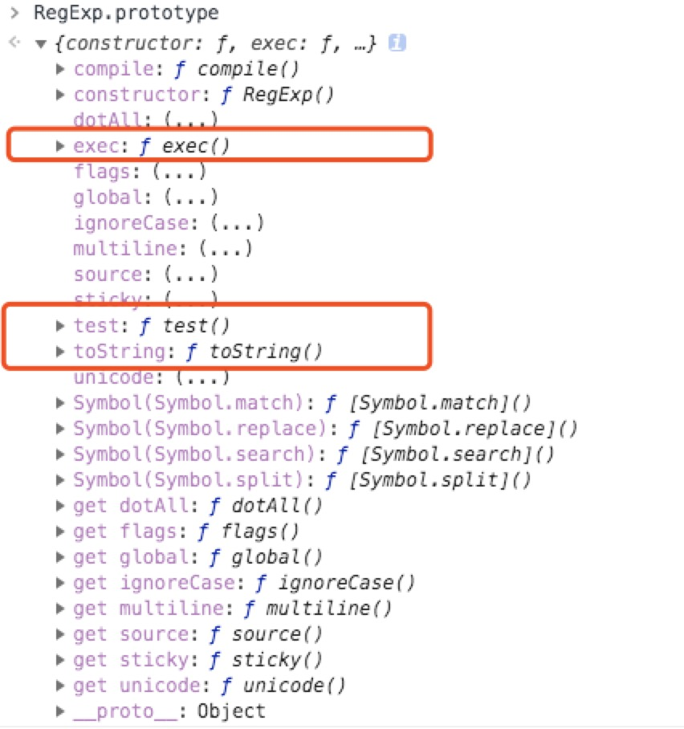
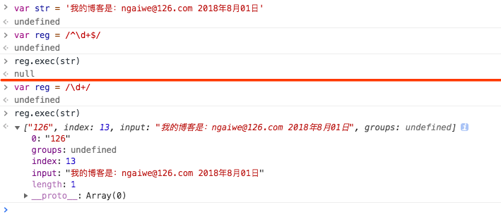
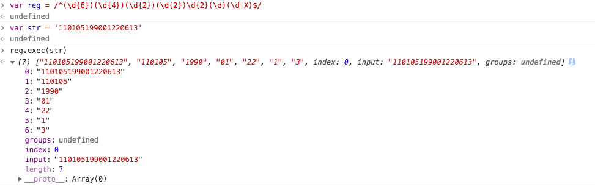
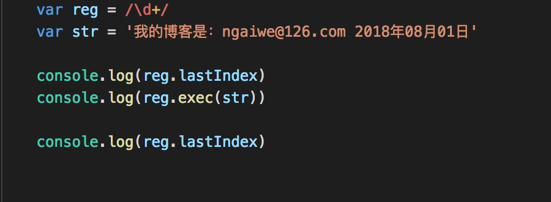
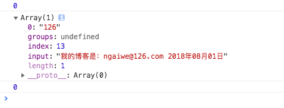
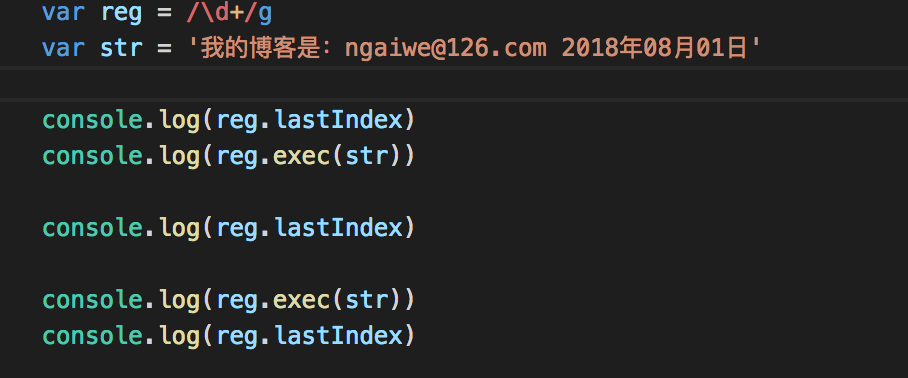
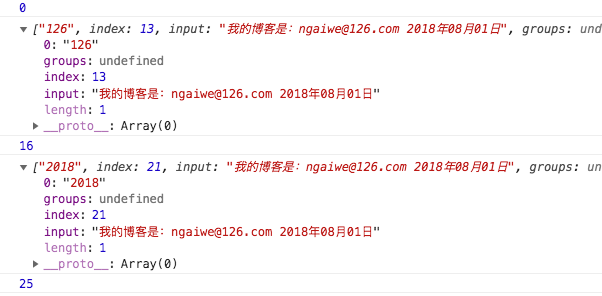
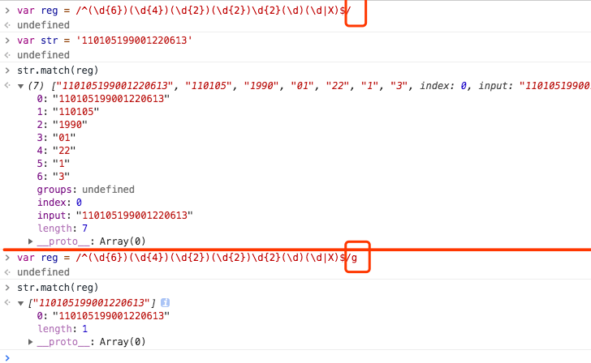
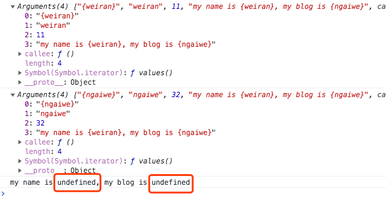

## 简述

>正则表达式是处理字符串的利器，并提高工作效率，一个好的正则能够帮我们省去几十甚至上百行代码。在工作中，也许你会见到在代码中出现很多正则处理字符串，也可能见到代码中毫无正则，原因在于会正则的人往往处理字符串首先想到用正则去处理，不会的那必然用很多API处理。并且在面试的时候很多同学往往挂在正则这里，所以对于前端正则是一个必备技能。这篇文章不光能教会你如何使用它，还能让你懂得其中的原理，在以后使用和面试中将做到毫无惧怕。

## 一.基础
>要想玩转正则首先要明白三大元素：`修饰符` `元字符` `量词`  
>例：var reg = /^\d$/g 这是一个简单点正则，下面我们来对三大元素一探究竟

#### 1.修饰符
- `g` - global 全局匹配（只要有匹配成功的结果一直匹配直到没有为止）
- `i` - ignoreCase 忽略大小写
- `m` - multiline 多行匹配​

#### 2.元字符
>元字符其中分为特殊元字符和普通元字符  
>普通元字符就是列入数组，字母等元素  
>常用特殊元字符如下：

- `\` 转义字符（把一个普通字符转变为有特殊意义的字符，或者把一个有意义的字符转变为普通字符）
- `.` 除了\n（换行符）​以外的任意字符
- `\d` 匹配一个0~9之间的数字
- `\D` 匹配一个非0~9之间的数字（大写与小写字母组合正好是相反含义）​​
- `\w` 匹配一个0~9或字母或_之间的一个字符
- `\s` 匹配一个任意空白字符
- `\b` 匹配一个边界符
- `x|y` 匹配x或者y中的一个
- `[a-z]` 匹配a-z中的任意一个字符
- `[^a-z]` 匹配非a-z中的任意一个字符
- `[xyz]` 匹配x或y或z中的一个字符
- `[^xyz]` 和上方相反
- `()` 整的小分组，匹配一个小分组（可以理解为大正则中的一个小正则）
- `^` 以某一个元字符开始
- `$` 以某一个元字符结束
- `?:` 只匹配不捕获
- `?=` 正向肯定预查
- `?!` 正向否定预查​​

#### 3.量词
> 量词主要的作用是用来描述元字符出现的次数 如下：

- `+` 让前面的元字符出现一到多次
- `?` 出现零到一次
- `*` 出现零到多次
- `{n}` 出现n次
- ​​​​`{n,}` 出现n到多次
- `{n,m}` 出现n到m次​

> 看到这里大家一定有些晕，这些稀奇古怪的符号，到底如何运用，下面将带大家去运用这些字符，在运用之前同学们要做到牢记 牢记 牢记这些字符，想要玩转正则必须要的就是牢记他们，当你牢记这些字符的同时说明你已经入门了。

## 二.元字符
- 1.开始元字符 `^`

	>匹配启示位置的元字符，例：var reg = /^2/; 表示开头必须是2，如果开始元字符放在[]里面
	>例：[^]表示非中括号种情况 相反含义
	
- 2.结束元字符 `$`

	>匹配结束位置的元字符，例： var reg = /2$/; 表示结尾必须是2，如果是var reg = /^2$/; 表示只能为2，因为2只代表一个元字符。
	
- 3.转义字符 `\`

	>将特殊元字符转换为普通字符，例：var reg = /^2.3$/ 正常理解为匹配启示为2 结束为3中间是`.`的正则，但是在这里面`.`属于特殊元字符，意义是除了`\n`（换行符）​以外的任意字符，所以不论是2.3/2+3/2s.3等等，只要是不·`\n`都匹配成功，所以为了这种需求就用到了转义字符`\` 如下： var reg = /^2\\.3$/ 将特殊元字符`.`转义为真正的`.`元素，再次匹配只有2.3才能匹配成功 如下思考：
	
	``` javascript
		var reg1 = /^\d$/
		var reg2 = /^\\d$/
		var reg3 = /^\\\d$/
		var reg4 = /^\\\\d$/
	```
	>首先reg1 表示0-9之间的数字 所以0-9都能匹配成功  
	>reg2出现两个`\` 不论是0-9 d \d都匹配失败，只有`\\d`才匹配成功，原因在于第一个转义字符把第二个`\`转义为普通`\`，此时第一个`\`也表示普通字符，所以只有匹配到`\\d`才生效  
	>reg3出现三个`\`，此时大家一定会认为`\\\d`才是正确答案，非也，此时的正确答案是`\\[0-9]`意思是\\和0-9中任意一个数字，原因在于第一个`\`将第二个转义，所以变为`\\ \d`分为了两部分，`\\`为普通字符，而`\d`表示一个0~9之间的数字，所以正确答案是`\\[0-9]`  
	>reg4出现四个`\` 很多同学会认为正确答案一定是`\\\[0-9]`, 很可惜，正确的是`\\\\d`，原因是当第一个把第二个转义为普通字符时，第三个又把第四个转义为普通字符，所以最后匹配为`\\\\d`  
	>看到这里相信有一部分小伙伴已经晕了，虽然在工作我们不会玩这种操作，但是要深刻理解转义字符，在正则中如果你直接写 var reg = /^\$/会报错，因为正则中不能单独一个`\`出现，因为他是一个特殊元字符，需要写至少两个`\`, 例如： `var reg = /^\\$/` 正确的匹配结果为`'\\'`，所以牢记两个`\`代表真正的`\`，这里搞明白的同学，相信转义字符已经完全掌握。
	
- 4.或者元字符 `x|y`

	>这个元字符很好理解就是匹配x或者匹配y，没有什么难度，举个小例子：
	
	```javascript
	var reg = /2|3/
	// 匹配数字为2或者为3
	```
	
- 5.小分组 `()`

	> 在上面同学们会发现用了`()`这样的元字符，他主要的特点就是将括号内的正则规则看成一个整体，相当于一个小的独立的正则，主要处理如下例子中的问题
	
	```javascript
	var reg = /^18|19$/
	
	// 这个例子很多同学能够了解是18或者19开头 但是结尾呢？真的只匹配19么？ 其实并不是
	// 正确的匹配除了18 19 还有119、181、189、819 这时候小分组就起到了作用如下
	
	var reg = /^(18|19)$/
	
	// 这里将18或19用()包裹起来，起到小分组的作用
	// 这样这个正则只匹配18开头结尾或者19而不是181和189
	```

- 6.分组引用 `\n`
	>分组引用的概念就是可以引用大正则中指定的小正则规则，例如：  
	
	```javascript
	var reg = /^([a-z])([a-z])\2([a-z])$/
	// 符合的字符串：book week http ...​
	```
	>具体上面的例子理解为`\2`代表着第二个小正则规则的完全引用，就是和第二个小正则`([a-z])`一样，可以减少正则的复杂度和处理多次重复规则
	
	
- 7.匹配字符 `[]`
	
	>`[xyz]`、`[^xyz]`、`[a-z]`、`[^a-z]`下面举个小例子，便于同学们理解
	
	```javascript
	var reg = /^[a-zA_Z0-9_]$/
	// 这个正则和等价于\w 就是匹配一个0~9或字母或_之间的一个字符
	// 而正则[xyz]中的xyz分别代表a-z、A_Z、0-9,xyz只是一个代表标识，可以有xyzhw各种组合
	// 就像这个例子中有下划线_一样四个的匹配
	// 有一个重点补充，在[]中的特殊元字符一般都代表本身含义，如下
	var reg = /^[.?+&]$/
	// 代表着匹配. .? ?+ ...等等
	```
	
- 8.边界符 `\b`

	>匹配一个单词边界，也就是指单词和空格间的位置（边界主要是单词的左右两边） 例如：
	
	```javascript
	var reg = /er\b/
	// 可以匹配never中的er，但是不能匹配verb中的er
	var reg = /\b\w+\b/g
	// 能匹配字母数字和下划线与单词边界 'my blog is www.ngaiwe.com'
	// 能匹配 'my'、'blog'、'is'、'www'、'ngaiwe'、'com'
	```
	
- 9.只匹配不捕获 `?:`	
	>下面举一个例子，但是涉及到捕获内容，如果同学们不太明天，可以先跳过此处，看完下面捕获，再返回来看
	
	```javascript
	var reg = /^(\d{6})(\d{4})(\d{2})(\d{2})\d{2}(\d)(\d|X)$/g
	var str = '110105199001220613'
	console.log(reg.exec(str))
	// 打印结果为 "110105199001220613", "110105", "1990", "01", "22", "1", "3"
	
	var reg = /^(\d{6})(?:\d{4})(\d{2})(\d{2})\d{2}(\d)(\d|X)$/g
	// 打印结果为 "110105199001220613", "110105", "01", "22", "1", "3"
	// 会将第二个小分组只匹配，不捕获
	```
	
- 10.正向肯定预查 `?=`
	>这个概念比较难理解，用于就是为了匹配一个元素后面是的元素是否符合相应规则，但是并不消耗这个规则，例子1：

	```javascript
	var reg = /windows(?=95|98|NT|2000)/
	var str1 = 'windows2000'
	var str2 = 'windowsxp'
	
	console.log(reg.test(str1))
	console.log(reg.test(str2))
	// str1 为true str2 为false
	
	console.log(reg.exec(str1))
	console.log(reg.exec(str2))
	// 能捕获到str1 并且捕获结果时windows 并没有将2000也同时捕获
	// 说明正向预查只负责匹配相应规则
	```
	>例子2：
	
	```javascript
	var reg1 = /win(?=d)dows/
	var reg2 = /win(d)dows/
	var str = 'windows'
	console.log(reg1.test(str))
	console.log(reg2.test(str))
	// reg1 返回true reg2返回 false
	// 原因是正向预查只负责匹配，不消耗字符，也就是并不会匹配为里面规则的字符
	// reg1 相当于匹配windows并且符合win后面第一个出现的是d
	// reg2 相当于匹配winddows
	```
	
- 11.正想否定预查 `?!`
	>和正向肯定预查相反，匹配不符合规则的正则

## 三.正则的两种创建方式
>正则的创建方式分为两种，一种是字面量创建，另一种是构造函数创建

- 1.字面量创建  
	>`var reg = /\d+/img`

- 2.构造函数创建
	>`var reg = new RegExp('\\d+', 'img')` 第一个参数是元字符并且\d这种特殊字符在这里面是普通字符，所以需要用\转义为特殊字符，第二个参数是修饰符

	>这两种的用途有区别，一般需要动态创建正则元字符采用构造函数创建，因为里面元字符是字符串拼接，常规固定写死正则采用字面量创建，例子如下：

	```javascript
	var stringMode = 'string'
	var reg = new RegExp(`^\\[object ${stringMode}\\]$`)
	console.log(reg.toString())
	```
	
## 四.正则原型方法
> 首相上一张图让同学们看一下正则一共有哪些方法，如下：



>可以看到正则原型对象上一共就三个方法,`exec` `test`和`toString`  

- 1.`exec`该方法主要应用于捕获组而设计，实参是要匹配的字符串。如图所示：  

	

	#### 捕获原理
	
	- 1.在捕获的时候先验证当前字符串和正则是否匹配，不匹配返回null（没有捕获到任何内容） 
	- 2.如果匹配从字符串最左边开始，向右查找到匹配内容，并把匹配的内容返回 

	#### 捕获结果
	
	- 1.结果是一个数组
	- 2.第一项0 是当前本次大正则中匹配的结果
	- 3.`index `是匹配到的结果在字符串中的索引位置
	- 4.`input `当前正则操作的原始字符串
	- 5.如果大正则中有分组`()`，获取的数组中从第二项开始都是每个小分组的捕获结果
	- 下面举一个身份证正则的例子 便于参考，具体里面匹配规则下面会单独介绍，这里只学习字段意义 
 
	

- 2.懒惰性

	> 正则捕获存在懒惰性，在上面exec中，执行一次exec只捕获到第一个符合规则的内容，第二次执行exec也是捕获到第一个内容，后面的内容不论执行多少次都无法捕获到

	#### 解决方法
	
	>在正则的末尾加修饰符g（全局匹配）
	
	#### 原理
	
	>如图所示，正则本身有一个属性 `lastIndex` 下一次正则在字符串中匹配查找的开始索引  
	>默认值是0，从字符串第一个位置开始查找，由此可见，当执行完exec后`lastIndex`并没有变，并且就算手动修改`lastIndex`也不会起作用，浏览器不识别  

	
	

	>加上了修饰符g就解决了这个问题，因为每一次exec之后，浏览器默认会修改`lastIndex`，下一次从上一次结束的位置开始查找，所以可以得到后面内容
	
	
	
	
	>我们来手动创建一个函数来实现匹配到全部内容并且都捕获到，如下：
	
	```javascript
	var reg = /^(\d{6})(\d{4})(\d{2})(\d{2})\d{2}(\d)(\d|X)$/g
	var str = '110105199001220613'
	
	RegExp.prototype.myExec = function myExec() {
		var str = arguments[0] || ''
		var result = []
		// 首先this指向的是RegExp，所以判断this是否加了全局修饰符g
		// 如果没有，防止执行死循环，我们只执行一次exec并将其返回即可
		
		if(!this.global) {
			return this.exec(str)
		}
		
		var arrs = this.exec(str)
		while(arrs) {
			result.push(arrs[0])
			// 此时lastIndex的值已经变为上一次的结尾
			arrs = this.exec(str)
		}
		return result
	}
	```
	
	>这个方法当正则reg加了修饰符g 则返回大正则匹配到结果，如果没加g则返回exec捕获结果
	
- 3.`test` 该方法主要应用于正则匹配，当然也可以用在捕获上面

	>从字符串左侧开始匹配，匹配到符合正则规则的字符，返回true，否则返回false，同样的`test`在修饰符g下也会修改`lastIndex`的值

	#### 运用`test`实现捕获
	
	```javascript
	var reg = /\{([a-z]+)\}/g
	var str = 'my name is {weiran}. I am from {china}'
	var result = []
	while (reg.test(str)) {
		result.push(RegExp.$1)
	}
	console.log(result)
	// ['weiran', 'china']
	```

	> 当test匹配到结尾或者匹配不到时，返回false，成功则向数组添加当前小分组匹配第一个元素内容
	> 在RegExp的constructor中存在`$1`-`$9`，他们的具体指的是当前本次匹配小分组第一到第九捕获的内容

- 4.`toString`

 >就是将正则表达式转化为字符串

## 五.字符串正则方法

- 1.`match`

	>同样是捕获的方法，如图所示：

	

	>当加了修饰符g，返回的是大正则匹配结果组成的数组，不加修饰符g则返回大正则和每个小分组返回结果组成的数组，跟上面我们手写的myExec一样，其实原理就是我们上面写的方法，如果想在加了修饰符g的时候返回结果和没加一样，所以在直接用`match`方法就能将匹配内容全部捕获到。
	>但是他也有局限性，就想上面说的在加了修饰符g的时候，会忽略小分组捕获内容，只捕获大正则捕获内容，解决办法就向上面myExec一样，将arrs[0]改为arrs，在每次匹配到结果时，将每个小分组也保存下来。

- 2.`replace`

	>主要运用在替换，其中两个参数，第一个为要替换的字符串或者正则，第二个是替换内容或一个返回函数，具体操作如下：

	```javascript
	var str = 'my name is {weiran}, my blog is {ngaiwe}'
	var reg = /\{([a-z]+)\}/
	str = str.replace(reg, '123')
	console.log(str)
	// 打印出 my name is 123, my blog is {ngaiwe}
	// 同学们会发现和exec的懒惰性很相似，不加修饰符g 只匹配第一个lastIndex没有改变

	var reg = /\{([a-z]+)\}/g
	// 打印出 my name is 123, my blog is 123
	```
	>并且replace不会修改原始字符串

	

	```javascript
	var str = 'my name is {weiran}, my blog is {ngaiwe}'
	var reg = /\{([a-z]+)\}/g
	str = str.replace(reg, function () {
		console.log(arguments)
	})
	// 打印出当前匹配的小分组，如果函数中没有return出替换值，则返回undefined
	```

- 3.`split`

	>按照正则方式可以拆分成数组，具体例子如下：

	```javascript
	var str = 'weiRanNgaiWe'
	var reg = /[A-Z]/
	console.log(str.split(reg))
	// ["wei", "an", "gai", "e"]按照大写拆分成数组
	```

- 4.`search`

	>类似于`indexOf`,返回匹配元素的起始位置，如果没有返回-1，不支持修饰符g

	```javascript
	var str = 'ngaiwe@126.com'
	var reg = /\d+/
	console.log(str.search(reg))
	// 返回 7
	```

## 六.实战案例剖析

- 1.身份证号码

	>举个身份证的例子： 110105199109214237  
	>由此分析前6位是数字地区区号组成，然后四位是年，两位月，两位日和四位随机，倒数第二位单数男性，双数女性，最后一位可能是大写X,所以根据这个规则的正则是

	```javascript
	var str = '110105199109214237'
	var reg = /^(\d{6})(\d{4})(\d{2})(\d{2})\d{2}(\d)(\d|X)$/
	console.log(reg.exec(str))
	// ["110105199109214237", "110105", "1991", "09", "21", "3", "7", index: 0, input: "110105199109214237", groups: undefined]
	```

- 2.邮箱

	> 举个邮箱的例子：weiran@vipkid.com.cn  
	> 由此分析：  
	> 1.@前面可能是数字、字母、下划线、-、.  
	> 2.-和.不能相连在一起  
	>/^\w+((-|\w+)|(\.\w+))*/ 开头一定是数字，字母或下划线组成，后面的内容可能是-与数字字母下划线 或者.和数字字母下划线组成的0到多个字符   
	> 3.@后面部分  
	> 首先一定是数字字母组成的多位字符  
	> 然后可能存在是.组成的邮箱后缀或者链接前方字符的.和-  
	> 最后肯定是.组成的邮箱后缀

	```javascript
	var reg = /^\w+((-|\w+)|(\.\w+))*@[a-zA-Z0-9]+((\.|-)[a-zA-Z0-9]+)*\.[a-zA-Z0-9]+$/
	var str = 'weiran@vipkid.com.cn'
	console.log(reg.test(str))
	// true
	```

- 3.URL截取

	>举个截取url参数的例子：  
	>http://www.ngaiwe.com/page/index.html?name=weiran&age=27&sex=0#develpoment  
	>我们想要的是参数转化键值对和哈希值{name: 'weiran',age: 27, sex: 0, HASH: 'develpoment'}  
	>由此分析：  
	>需要分为两部分捕获，首先第一次捕获?后面的参数，第二次捕获#后面的hash值  
	>首先匹配第一个，他的规则是匹配等号两边所以是/()=()/，并且匹配的是非?&=#的特殊字符，将他们保存在obj对象中  
	>其次匹配hash，方法和第一个类似只是匹配#后面的部分

	```javascript
	String.prototype.myQueryURLParameter = function myQueryURLParameter () {
		var obj = {}
		this.replace(/([^?&=#]+)=([^?&=#]+)/g, function () {
			obj[arguments[1]] = arguments[2]
		})
		this.replace(/#([^?&=#]+)/g, function () {
			obj['HASH'] = arguments[1]
		})
		return obj
	}
	```

## 七.总结  
  >具体案例就就少到这里，网上有各种正则的案例，同学们以后看到案例具体分析他们是如何写的，不要一味地使用，这样才能在工作中不断地思考，学习。

## 八.博客

[魏燃技术博客](http://www.ngaiwe.com)

有任何问题可留言或者发送本人邮箱ngaiwe@126.com

## 九.分享
[正则元字符表](http://www.runoob.com/regexp/regexp-metachar.html)  
[正则在线测试工具](https://c.runoob.com/front-end/854)

	
